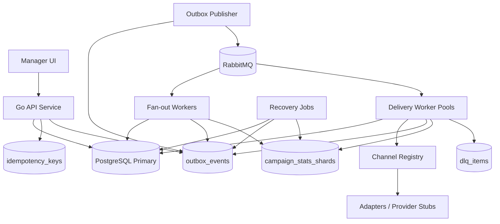

# Notification Platform — Production-compatible MVP

Версия: 1.1  
Стек MVP: Go API, PostgreSQL, RabbitMQ, Go workers, provider stubs  
MVP-регион: `default`  
Семантика доставки: `at-least-once + idempotency`, без обещания настоящего exactly-once

---

## 0. Цель документа

Этот документ описывает MVP сервиса нотификаций так, чтобы он:

- закрывал задачу хакатона;
- выдерживал рассылку на `50k` пользователей;
- не делал fan-out и provider calls в `POST /campaigns`;
- позволял добавлять и отключать каналы без миграций БД;
- сохранял immutable delivery log: получатель, канал, сообщение, время;
- переживал рестарты API, workers, publisher и RabbitMQ consumers;
- имел прямой путь к production: regional sharding, Kafka/CDC, Debezium, read replicas, partitioning.

Главная фиксация по SLO:

```text
SLO:
  POST /campaigns p95 < 1500 ms

Scope:
  validation + campaign creation + campaign_region_runs + outbox insert + commit

Not in scope:
  fan-out на 50k users
  создание всех delivery_tasks
  provider calls
  ожидание полной доставки
```

Provider stub по задаче спит случайно `2-300 секунд`, поэтому end-to-end delivery не может входить в `p95 < 1500 ms`.

---

## 1. Ключевые product / engineering решения

| Область | Решение MVP |
|---|---|
| Source of truth | PostgreSQL для campaigns, tasks, attempts, results, outbox, stats, DLQ |
| RabbitMQ | Durable signal layer, не source of truth |
| API latency | `POST /campaigns` только пишет campaign/run/outbox и возвращает `202` |
| Dynamic channels | `channels.queue_group`, routing по `region + queue_group + priority`, реальный `channelCode` остается в payload |
| Delivery log | Immutable snapshots в `delivery_tasks` и `delivery_results` |
| Retry | DB truth через `delivery_tasks.available_at`; RabbitMQ TTL buckets только wake-up signal |
| DLQ | PostgreSQL `dlq_items` — product/source-of-truth DLQ; RabbitMQ DLQ — transport safety net |
| Long provider calls | Lease heartbeat каждые `30s`, provider timeout `320s`, lease extension `120s` |
| Attempts | Lease и `delivery_attempts(status=started)` создаются атомарно в одной транзакции |
| Stats | Обновляются только внутри успешного state transition; есть reconciliation job |
| Outbox | Partition-ready: `region_id NOT NULL`, `PRIMARY KEY(region_id, id)`, `UNIQUE(region_id, dedupe_key)` |
| Hot tables | Shard-ready keys: `PRIMARY KEY(region_id, campaign_region_run_id, id)` где это важно |
| Semantics | At-least-once; duplicate provider call возможен после crash, если provider не поддерживает idempotency |

---

## 2. MVP architecture



### 2.1 Components

| Component | Responsibility |
|---|---|
| Manager UI | Создание кампаний, выбор recipients/channels, просмотр stats/results/errors/DLQ |
| API | Validation, idempotency, campaign/channel/DLQ/users endpoints; не делает fan-out и delivery |
| PostgreSQL | Source of truth для состояния и истории |
| Outbox Publisher | Читает `outbox_events`, публикует в RabbitMQ с publisher confirms |
| RabbitMQ | Durable queues, retry buckets, transport DLQ, manual ack, prefetch |
| Fan-out Worker | Resolve recipients, create campaign_recipients, delivery_tasks, outbox signals |
| Delivery Worker | Lease task, create attempt, heartbeat lease, call adapter, finalize result/retry/DLQ |
| Channel Registry | Cache + live checks для global/regional channel config |
| Provider Stub | Random sleep `2-300s`, random success/transient/permanent error |
| Recovery Jobs | Outbox recovery, lease recovery, retry scanner, stats reconciliation, campaign finalizer |

---

## 3. API contracts

### 3.1 Common conventions

#### Idempotency

Для mutating endpoints обязательно:

```http
Idempotency-Key: <client-generated-key>
```

Правила:

```text
same scope + same key + same request_hash -> return saved response
same scope + same key + different request_hash -> 409 IDEMPOTENCY_KEY_REUSED
same scope + same key while first request processing -> 409 REQUEST_ALREADY_PROCESSING
```

Scope:

```text
<manager_id>:<method>:<route_template>
```

#### Error envelope

```json
{
  "error": {
    "code": "VALIDATION_ERROR",
    "message": "selected channel is disabled in region default",
    "details": {
      "channelCode": "sms",
      "regionId": "default"
    }
  }
}
```

#### Pagination

```http
?limit=50&cursor=<opaque_cursor>
```

Cursor должен кодировать stable sort:

```text
created_at DESC, id DESC
```

---

### 3.2 Campaign API

| Method | Route | Purpose |
|---|---|---|
| `POST` | `/campaigns` | Create campaign async, return `202` |
| `GET` | `/campaigns` | List campaigns |
| `GET` | `/campaigns/{id}` | Get campaign |
| `GET` | `/campaigns/{id}/stats` | Read stats shards |
| `GET` | `/campaigns/{id}/tasks` | List tasks |
| `GET` | `/campaigns/{id}/results` | List immutable final results / delivery log |
| `GET` | `/campaigns/{id}/errors` | List failed attempts/tasks |
| `POST` | `/campaigns/{id}/cancel` | Async cancellation |

#### Recipient selector: all

```json
{
  "type": "all"
}
```

Resolution:

```sql
SELECT region_id, id
FROM users
WHERE region_id = $1
  AND status = 'active';
```

#### Recipient selector: user_ids

```json
{
  "type": "user_ids",
  "userIds": [
    "9a7a6b2e-4f5a-4b3f-b8a6-4b2c2e1d5c7f",
    "65b5fd95-d8b7-4c5e-8bc5-a560c7e65d77"
  ]
}
```

Rules:

```text
userIds must belong to requested regionIds
inactive/blocked users are skipped
inline request limit: 10_000 userIds
larger lists later move to saved/imported audience
```

#### Recipient selector: external_ids

```json
{
  "type": "external_ids",
  "externalIds": ["crm_123", "crm_456"]
}
```

#### Recipient selector: segment

For MVP this is optional and whitelist-based only:

```json
{
  "type": "segment",
  "filter": {
    "country": "DE",
    "plan": "premium"
  }
}
```

Rules:

```text
no arbitrary SQL
only allowed fields/operators
bounded query plan
validated by API
```

---

### 3.3 `POST /campaigns`

Request:

```json
{
  "name": "May promo",
  "regionIds": ["default"],
  "message": {
    "subject": "Promo",
    "body": "Hello! New offer for you."
  },
  "recipientSelector": {
    "type": "all"
  },
  "channels": ["email", "sms", "telegram"],
  "priority": "normal"
}
```

Response:

```json
{
  "campaignId": "f1fc89aa-ff5c-45cf-908c-3753b3c7fc80",
  "status": "running",
  "regionRuns": [
    {
      "id": "7b5b2430-3712-45f7-82be-ff6714a9478c",
      "regionId": "default",
      "status": "fanout_pending"
    }
  ]
}
```

Status:

```text
202 Accepted
```

Transaction:

```text
1. Validate request body.
2. Validate Idempotency-Key.
3. Validate regions.
4. Validate channels and channel_regional_configs.
5. Insert campaign with message_snapshot and recipient_selector.
6. Insert campaign_region_runs per region.
7. Insert CampaignRegionRunRequested outbox event per region run.
8. Save idempotency response.
9. Commit.
10. Return 202.
```

Not allowed in `POST /campaigns`:

```text
resolve users
create 50k delivery_tasks
call provider stub
wait for RabbitMQ
wait for fan-out
wait for delivery completion
```

---

### 3.4 `GET /campaigns/{id}/stats`

Reads only `campaign_stats_shards`.

Response:

```json
{
  "campaignId": "f1fc89aa-ff5c-45cf-908c-3753b3c7fc80",
  "status": "running",
  "stats": {
    "totalTasks": 100000,
    "queued": 20000,
    "sending": 1000,
    "succeeded": 70000,
    "failed": 500,
    "retryScheduled": 8000,
    "deadLettered": 500,
    "cancelled": 0
  },
  "consistency": "eventual",
  "updatedAt": "2026-05-14T10:00:00Z"
}
```

Dashboard must not do online aggregation:

```sql
-- запрещено в online path
SELECT status, count(*)
FROM delivery_tasks
WHERE campaign_id = $1
GROUP BY status;
```

---

### 3.5 `GET /campaigns/{id}/results`

This is the main delivery log endpoint.

Query:

```http
GET /campaigns/{id}/results?regionId=default&status=succeeded&channel=telegram&limit=50&cursor=...
```

Response:

```json
{
  "items": [
    {
      "taskId": "c42240ff-6e7f-4f8d-af53-42a1bbcb5b5b",
      "regionId": "default",
      "userId": "9a7a6b2e-4f5a-4b3f-b8a6-4b2c2e1d5c7f",
      "recipient": "+491111111",
      "channel": "telegram",
      "message": {
        "subject": "Promo",
        "body": "Hello! New offer for you."
      },
      "status": "succeeded",
      "attemptCount": 1,
      "providerCode": "stub-telegram",
      "providerRequestId": "prov_req_123",
      "createdAt": "2026-05-14T10:00:00Z",
      "startedAt": "2026-05-14T10:00:05Z",
      "completedAt": "2026-05-14T10:02:17Z"
    }
  ],
  "nextCursor": "opaque_cursor"
}
```

Important:

```text
recipient, channel, message and timestamps are read from immutable snapshots.
No historical result should depend on current user_channel.address or campaign.message.
```

---

### 3.6 Channel API

| Method | Route | Purpose |
|---|---|---|
| `GET` | `/channels` | List channels |
| `POST` | `/channels` | Create channel |
| `PATCH` | `/channels/{id}` | Update metadata/config |
| `POST` | `/channels/{id}/enable` | Enable globally |
| `POST` | `/channels/{id}/disable` | Disable globally |
| `GET` | `/channels/{id}/regional-configs` | List regional configs |
| `PUT` | `/channels/{id}/regional-configs/{regionId}` | Upsert regional config |

Create messenger-like channel without new queue:

```json
{
  "code": "whatsapp",
  "displayName": "WhatsApp",
  "globalState": "enabled",
  "adapterName": "stub",
  "defaultAdapterVersion": "v1",
  "queueGroup": "messenger"
}
```

Regional config:

```json
{
  "state": "enabled",
  "adapterVersion": "v1",
  "providerCode": "stub-whatsapp",
  "configRef": "secret://notification/default/whatsapp/stub",
  "rateLimits": {
    "rps": 100,
    "maxConcurrency": 500
  },
  "retryPolicy": {
    "maxAttempts": 5,
    "baseDelaySeconds": 30,
    "maxDelaySeconds": 1800,
    "jitter": true
  },
  "disablePolicy": "retry_later"
}
```

---

### 3.7 DLQ API

| Method | Route | Purpose |
|---|---|---|
| `GET` | `/dlq` | List application DLQ from PostgreSQL |
| `POST` | `/dlq/replay` | Replay selected tasks |

`POST /dlq/replay` request:

```json
{
  "regionId": "default",
  "filter": {
    "campaignId": "f1fc89aa-ff5c-45cf-908c-3753b3c7fc80",
    "channel": "email",
    "errorCode": "PROVIDER_TIMEOUT"
  },
  "limit": 1000,
  "additionalAttempts": 3,
  "reason": "provider recovered"
}
```

Behavior:

```text
1. Select open dlq_items by filter.
2. For task status=dead_lettered:
   - increase max_attempts if needed
   - set status=queued
   - set available_at=now()
   - clear lease fields
3. Insert DeliveryTaskCreated or TaskRetryScheduled outbox event.
4. Update stats: dead_lettered -1, queued +1.
5. Mark dlq_items as replayed.
```

---

## 4. PostgreSQL schema

### 4.1 Status values

Use `TEXT + CHECK`, not PostgreSQL enum, to make MVP migration-friendly.

```text
regions.state: enabled, disabled
channels.global_state: enabled, disabled
channel_regional_configs.state: enabled, disabled, degraded
campaigns.status: running, completed, partially_failed, failed, cancelling, cancelled
campaign_region_runs.status: fanout_pending, fanout_running, fanout_completed, fanout_failed, cancelling, cancelled
delivery_tasks.status: queued, sending, succeeded, failed, retry_scheduled, dead_lettered, cancelled
delivery_attempts.status: started, succeeded, failed, timed_out, stale
outbox_events.status: pending, publishing, published, failed, archived
dlq_items.status: open, replayed, ignored
```

---

### 4.2 `regions`

```sql
CREATE TABLE regions (
    id TEXT PRIMARY KEY,
    display_name TEXT NOT NULL,
    state TEXT NOT NULL CHECK (state IN ('enabled', 'disabled')),
    created_at TIMESTAMPTZ NOT NULL DEFAULT now(),
    updated_at TIMESTAMPTZ NOT NULL DEFAULT now()
);

INSERT INTO regions(id, display_name, state)
VALUES ('default', 'Default Region', 'enabled')
ON CONFLICT (id) DO NOTHING;
```

---

### 4.3 `users`

```sql
CREATE TABLE users (
    region_id TEXT NOT NULL REFERENCES regions(id),
    id UUID NOT NULL DEFAULT gen_random_uuid(),
    external_id TEXT,
    status TEXT NOT NULL CHECK (status IN ('active', 'inactive', 'blocked')),
    segment_attributes JSONB NOT NULL DEFAULT '{}'::jsonb,
    timezone TEXT,
    created_at TIMESTAMPTZ NOT NULL DEFAULT now(),
    updated_at TIMESTAMPTZ NOT NULL DEFAULT now(),
    PRIMARY KEY(region_id, id),
    UNIQUE(region_id, external_id)
);

CREATE INDEX idx_users_region_status ON users(region_id, status);
CREATE INDEX idx_users_segment_attrs ON users USING GIN(segment_attributes);
```

---

### 4.4 `channels`

```sql
CREATE TABLE channels (
    id UUID PRIMARY KEY DEFAULT gen_random_uuid(),
    code TEXT UNIQUE NOT NULL,
    display_name TEXT NOT NULL,
    global_state TEXT NOT NULL CHECK (global_state IN ('enabled', 'disabled')),
    adapter_name TEXT NOT NULL,
    default_adapter_version TEXT NOT NULL,

    -- Decouples product channel from physical queue.
    queue_group TEXT NOT NULL
        CHECK (queue_group IN ('email', 'sms', 'push', 'messenger', 'dedicated')),

    capabilities JSONB NOT NULL DEFAULT '{}'::jsonb,
    created_at TIMESTAMPTZ NOT NULL DEFAULT now(),
    updated_at TIMESTAMPTZ NOT NULL DEFAULT now()
);

CREATE INDEX idx_channels_state ON channels(global_state);
```

Examples:

```text
email       -> queue_group=email
sms         -> queue_group=sms
push        -> queue_group=push
telegram    -> queue_group=messenger
whatsapp    -> queue_group=messenger
viber       -> queue_group=messenger
```

---

### 4.5 `channel_regional_configs`

```sql
CREATE TABLE channel_regional_configs (
    region_id TEXT NOT NULL REFERENCES regions(id),
    id UUID NOT NULL DEFAULT gen_random_uuid(),
    channel_id UUID NOT NULL REFERENCES channels(id),

    state TEXT NOT NULL CHECK (state IN ('enabled', 'disabled', 'degraded')),
    adapter_version TEXT NOT NULL,
    provider_code TEXT,
    config_ref TEXT,

    rate_limits JSONB NOT NULL DEFAULT '{"rps":10,"maxConcurrency":10}'::jsonb,
    retry_policy JSONB NOT NULL DEFAULT '{"maxAttempts":5,"baseDelaySeconds":30,"maxDelaySeconds":1800,"jitter":true}'::jsonb,

    disable_policy TEXT NOT NULL DEFAULT 'retry_later'
        CHECK (disable_policy IN ('retry_later', 'fail_fast')),

    created_at TIMESTAMPTZ NOT NULL DEFAULT now(),
    updated_at TIMESTAMPTZ NOT NULL DEFAULT now(),

    PRIMARY KEY(region_id, id),
    UNIQUE(channel_id, region_id)
);

CREATE INDEX idx_channel_regional_region_state ON channel_regional_configs(region_id, state);
CREATE INDEX idx_channel_regional_channel_region ON channel_regional_configs(channel_id, region_id);
```

---

### 4.6 `user_channels`

```sql
CREATE TABLE user_channels (
    region_id TEXT NOT NULL,
    id UUID NOT NULL DEFAULT gen_random_uuid(),
    user_id UUID NOT NULL,
    channel_id UUID NOT NULL REFERENCES channels(id),

    address TEXT NOT NULL,
    address_hash TEXT,
    status TEXT NOT NULL CHECK (status IN ('active', 'inactive', 'bounced', 'unsubscribed')),
    verified BOOLEAN NOT NULL DEFAULT false,
    priority INT,
    metadata JSONB NOT NULL DEFAULT '{}'::jsonb,

    created_at TIMESTAMPTZ NOT NULL DEFAULT now(),
    updated_at TIMESTAMPTZ NOT NULL DEFAULT now(),

    PRIMARY KEY(region_id, id),
    FOREIGN KEY(region_id, user_id) REFERENCES users(region_id, id),
    UNIQUE(region_id, user_id, channel_id, address)
);

CREATE INDEX idx_user_channels_user ON user_channels(region_id, user_id);
CREATE INDEX idx_user_channels_region_channel_status ON user_channels(region_id, channel_id, status);
```

---

### 4.7 `campaigns`

```sql
CREATE TABLE campaigns (
    id UUID PRIMARY KEY DEFAULT gen_random_uuid(),
    manager_id UUID NOT NULL,
    name TEXT NOT NULL,

    status TEXT NOT NULL CHECK (status IN ('running', 'completed', 'partially_failed', 'failed', 'cancelling', 'cancelled')),
    message_snapshot JSONB NOT NULL,
    recipient_selector JSONB NOT NULL,
    selected_channel_codes TEXT[] NOT NULL,
    priority TEXT NOT NULL DEFAULT 'normal' CHECK (priority IN ('low', 'normal', 'high')),

    create_idempotency_key TEXT,
    cancel_reason TEXT,
    cancel_policy TEXT CHECK (cancel_policy IN ('cancel_not_started', 'cancel_all_non_final', 'stop_new_attempts')),

    scheduled_at TIMESTAMPTZ,
    started_at TIMESTAMPTZ,
    completed_at TIMESTAMPTZ,
    cancelled_at TIMESTAMPTZ,
    created_at TIMESTAMPTZ NOT NULL DEFAULT now(),
    updated_at TIMESTAMPTZ NOT NULL DEFAULT now()
);

CREATE UNIQUE INDEX uq_campaigns_manager_idempotency
ON campaigns(manager_id, create_idempotency_key)
WHERE create_idempotency_key IS NOT NULL;
```

---

### 4.8 `campaign_region_runs`

```sql
CREATE TABLE campaign_region_runs (
    region_id TEXT NOT NULL REFERENCES regions(id),
    id UUID NOT NULL DEFAULT gen_random_uuid(),
    campaign_id UUID NOT NULL REFERENCES campaigns(id),

    status TEXT NOT NULL CHECK (status IN ('fanout_pending', 'fanout_running', 'fanout_completed', 'fanout_failed', 'cancelling', 'cancelled')),

    fanout_lock_owner TEXT,
    fanout_lock_until TIMESTAMPTZ,
    fanout_attempt_count INT NOT NULL DEFAULT 0,
    fanout_cursor JSONB,

    fanout_started_at TIMESTAMPTZ,
    fanout_completed_at TIMESTAMPTZ,
    delivery_started_at TIMESTAMPTZ,
    delivery_completed_at TIMESTAMPTZ,

    last_error_code TEXT,
    last_error_message TEXT,
    created_at TIMESTAMPTZ NOT NULL DEFAULT now(),
    updated_at TIMESTAMPTZ NOT NULL DEFAULT now(),

    PRIMARY KEY(region_id, id),
    UNIQUE(campaign_id, region_id)
);

CREATE INDEX idx_campaign_region_runs_campaign ON campaign_region_runs(campaign_id);
CREATE INDEX idx_campaign_region_runs_region_status ON campaign_region_runs(region_id, status);
```

---

### 4.9 `campaign_recipients`

```sql
CREATE TABLE campaign_recipients (
    campaign_id UUID NOT NULL REFERENCES campaigns(id),
    region_id TEXT NOT NULL,
    campaign_region_run_id UUID NOT NULL,
    user_id UUID NOT NULL,
    snapshot JSONB NOT NULL DEFAULT '{}'::jsonb,
    created_at TIMESTAMPTZ NOT NULL DEFAULT now(),

    PRIMARY KEY(campaign_id, region_id, user_id),
    FOREIGN KEY(region_id, campaign_region_run_id) REFERENCES campaign_region_runs(region_id, id),
    FOREIGN KEY(region_id, user_id) REFERENCES users(region_id, id)
);

CREATE INDEX idx_campaign_recipients_run ON campaign_recipients(region_id, campaign_region_run_id);
```

---

### 4.10 `delivery_tasks`

Hot table. Key includes `campaign_region_run_id` to keep the table sub-sharding-ready.

```sql
CREATE TABLE delivery_tasks (
    region_id TEXT NOT NULL,
    campaign_region_run_id UUID NOT NULL,
    id UUID NOT NULL,

    campaign_id UUID NOT NULL REFERENCES campaigns(id),
    user_id UUID NOT NULL,
    user_channel_id UUID NOT NULL,

    recipient_snapshot JSONB NOT NULL DEFAULT '{}'::jsonb,
    recipient_address_snapshot TEXT NOT NULL,
    recipient_address_hash TEXT,
    recipient_label_snapshot TEXT,

    channel_id UUID NOT NULL REFERENCES channels(id),
    channel_code TEXT NOT NULL,
    queue_group TEXT NOT NULL,
    provider_code TEXT,

    message_snapshot JSONB NOT NULL,
    message_hash TEXT,

    idempotency_key TEXT NOT NULL,

    status TEXT NOT NULL CHECK (status IN ('queued', 'sending', 'succeeded', 'failed', 'retry_scheduled', 'dead_lettered', 'cancelled')),
    priority TEXT NOT NULL DEFAULT 'normal' CHECK (priority IN ('low', 'normal', 'high')),

    attempt_count INT NOT NULL DEFAULT 0,
    max_attempts INT NOT NULL DEFAULT 5,
    available_at TIMESTAMPTZ NOT NULL DEFAULT now(),

    lease_owner TEXT,
    lease_token UUID,
    lease_until TIMESTAMPTZ,

    last_error_code TEXT,
    last_error_message TEXT,

    created_at TIMESTAMPTZ NOT NULL DEFAULT now(),
    queued_at TIMESTAMPTZ NOT NULL DEFAULT now(),
    first_started_at TIMESTAMPTZ,
    last_started_at TIMESTAMPTZ,
    completed_at TIMESTAMPTZ,
    version INT NOT NULL DEFAULT 0,

    PRIMARY KEY(region_id, campaign_region_run_id, id),
    FOREIGN KEY(region_id, campaign_region_run_id) REFERENCES campaign_region_runs(region_id, id),
    FOREIGN KEY(region_id, user_id) REFERENCES users(region_id, id),
    FOREIGN KEY(region_id, user_channel_id) REFERENCES user_channels(region_id, id),
    UNIQUE(region_id, campaign_region_run_id, idempotency_key)
);

CREATE INDEX idx_tasks_campaign_status ON delivery_tasks(campaign_id, status);
CREATE INDEX idx_tasks_run_status ON delivery_tasks(region_id, campaign_region_run_id, status);
CREATE INDEX idx_tasks_region_queue_available
ON delivery_tasks(region_id, queue_group, status, available_at, priority)
WHERE status IN ('queued', 'retry_scheduled');
CREATE INDEX idx_tasks_sending_lease_until
ON delivery_tasks(region_id, lease_until)
WHERE status = 'sending';
```

Task ID:

```text
task_id = UUIDv5(namespace=campaign_id, name=region_id + ":" + user_channel_id + ":" + channel_id)
idempotency_key = "delivery:" + campaign_id + ":" + region_id + ":" + user_channel_id + ":" + channel_id
```

---

### 4.11 `delivery_attempts`

```sql
CREATE TABLE delivery_attempts (
    region_id TEXT NOT NULL,
    campaign_region_run_id UUID NOT NULL,
    id UUID NOT NULL DEFAULT gen_random_uuid(),

    task_id UUID NOT NULL,
    campaign_id UUID NOT NULL REFERENCES campaigns(id),
    attempt_no INT NOT NULL,
    worker_id TEXT,

    channel_id UUID NOT NULL REFERENCES channels(id),
    channel_code TEXT NOT NULL,
    queue_group TEXT NOT NULL,
    provider_code TEXT,

    status TEXT NOT NULL CHECK (status IN ('started', 'succeeded', 'failed', 'timed_out', 'stale')),
    started_at TIMESTAMPTZ,
    completed_at TIMESTAMPTZ,
    duration_ms BIGINT,

    result TEXT,
    error_type TEXT CHECK (error_type IS NULL OR error_type IN ('transient', 'permanent', 'unknown')),
    error_code TEXT,
    error_message TEXT,
    provider_request_id TEXT,
    request_payload_hash TEXT,

    created_at TIMESTAMPTZ NOT NULL DEFAULT now(),

    PRIMARY KEY(region_id, campaign_region_run_id, id),
    FOREIGN KEY(region_id, campaign_region_run_id, task_id)
        REFERENCES delivery_tasks(region_id, campaign_region_run_id, id),
    UNIQUE(region_id, campaign_region_run_id, task_id, attempt_no)
);

CREATE INDEX idx_attempts_task ON delivery_attempts(region_id, campaign_region_run_id, task_id);
CREATE INDEX idx_attempts_campaign_errors ON delivery_attempts(campaign_id, region_id, status, error_code);
```

---

### 4.12 `delivery_results`

```sql
CREATE TABLE delivery_results (
    region_id TEXT NOT NULL,
    campaign_region_run_id UUID NOT NULL,
    task_id UUID NOT NULL,

    campaign_id UUID NOT NULL REFERENCES campaigns(id),
    user_id UUID NOT NULL,
    user_channel_id UUID NOT NULL,
    channel_id UUID NOT NULL REFERENCES channels(id),
    channel_code TEXT NOT NULL,
    queue_group TEXT NOT NULL,

    recipient_snapshot JSONB NOT NULL DEFAULT '{}'::jsonb,
    recipient_address_snapshot TEXT NOT NULL,
    recipient_address_hash TEXT,
    recipient_label_snapshot TEXT,

    message_snapshot JSONB NOT NULL,
    message_hash TEXT,

    provider_code TEXT,
    provider_request_id TEXT,

    status TEXT NOT NULL CHECK (status IN ('succeeded', 'failed', 'dead_lettered', 'cancelled')),
    attempt_count INT NOT NULL,
    final_error_code TEXT,
    final_error_message_short TEXT,

    created_at TIMESTAMPTZ NOT NULL,
    started_at TIMESTAMPTZ,
    completed_at TIMESTAMPTZ NOT NULL,

    PRIMARY KEY(region_id, campaign_region_run_id, task_id),
    FOREIGN KEY(region_id, campaign_region_run_id, task_id)
        REFERENCES delivery_tasks(region_id, campaign_region_run_id, id)
);

CREATE INDEX idx_results_campaign_region_status ON delivery_results(campaign_id, region_id, status);
CREATE INDEX idx_results_region_completed ON delivery_results(region_id, completed_at);
```

For production optimization later:

```text
campaign_message_snapshots(id, campaign_id, message_snapshot, hash)
delivery_results(message_snapshot_id, message_hash, rendered_message_snapshot if personalized)
```

---

### 4.13 `dlq_items`

```sql
CREATE TABLE dlq_items (
    region_id TEXT NOT NULL,
    campaign_region_run_id UUID NOT NULL,
    id UUID NOT NULL DEFAULT gen_random_uuid(),

    task_id UUID NOT NULL,
    campaign_id UUID NOT NULL REFERENCES campaigns(id),
    channel_id UUID NOT NULL REFERENCES channels(id),
    channel_code TEXT NOT NULL,
    queue_group TEXT NOT NULL,

    reason_code TEXT NOT NULL,
    error_code TEXT,
    error_message TEXT,
    payload JSONB NOT NULL DEFAULT '{}'::jsonb,

    status TEXT NOT NULL DEFAULT 'open' CHECK (status IN ('open', 'replayed', 'ignored')),
    replay_count INT NOT NULL DEFAULT 0,
    first_dead_lettered_at TIMESTAMPTZ NOT NULL DEFAULT now(),
    last_replayed_at TIMESTAMPTZ,
    created_at TIMESTAMPTZ NOT NULL DEFAULT now(),
    updated_at TIMESTAMPTZ NOT NULL DEFAULT now(),

    PRIMARY KEY(region_id, campaign_region_run_id, id),
    FOREIGN KEY(region_id, campaign_region_run_id, task_id)
        REFERENCES delivery_tasks(region_id, campaign_region_run_id, id),
    UNIQUE(region_id, campaign_region_run_id, task_id)
);

CREATE INDEX idx_dlq_open_created ON dlq_items(region_id, created_at DESC) WHERE status = 'open';
CREATE INDEX idx_dlq_campaign ON dlq_items(campaign_id, region_id, status, created_at DESC);
```

---

### 4.14 `outbox_events`

Partition-ready version.

```sql
CREATE TABLE outbox_events (
    region_id TEXT NOT NULL REFERENCES regions(id),
    id UUID NOT NULL DEFAULT gen_random_uuid(),

    aggregate_type TEXT NOT NULL,
    aggregate_id UUID NOT NULL,
    campaign_region_run_id UUID,

    event_type TEXT NOT NULL,
    event_version INT NOT NULL DEFAULT 1,
    payload JSONB NOT NULL,
    headers JSONB NOT NULL DEFAULT '{}'::jsonb,

    exchange TEXT NOT NULL DEFAULT 'notification.direct',
    routing_key TEXT NOT NULL,
    stream_topic TEXT NOT NULL DEFAULT 'notification.outbox.v1',
    message_key TEXT NOT NULL,

    status TEXT NOT NULL DEFAULT 'pending'
        CHECK (status IN ('pending', 'publishing', 'published', 'failed', 'archived')),

    transport_mode TEXT NOT NULL DEFAULT 'rabbitmq_direct'
        CHECK (transport_mode IN ('rabbitmq_direct', 'cdc')),

    dedupe_key TEXT NOT NULL,
    locked_by TEXT,
    locked_until TIMESTAMPTZ,
    attempt_count INT NOT NULL DEFAULT 0,
    next_attempt_at TIMESTAMPTZ NOT NULL DEFAULT now(),
    last_error TEXT,

    created_at TIMESTAMPTZ NOT NULL DEFAULT now(),
    published_at TIMESTAMPTZ,

    PRIMARY KEY(region_id, id),
    UNIQUE(region_id, dedupe_key)
);

CREATE INDEX idx_outbox_pending_next_attempt
ON outbox_events(region_id, status, next_attempt_at, created_at)
WHERE status = 'pending';

CREATE INDEX idx_outbox_locked_until
ON outbox_events(region_id, locked_until)
WHERE status = 'publishing';
```

For global events:

```text
region_id = 'global'
```

---

### 4.15 `campaign_stats_shards`

```sql
CREATE TABLE campaign_stats_shards (
    campaign_id UUID NOT NULL REFERENCES campaigns(id),
    region_id TEXT NOT NULL REFERENCES regions(id),
    campaign_region_run_id UUID NOT NULL,
    shard_id INT NOT NULL CHECK (shard_id >= 0 AND shard_id < 64),

    total_tasks BIGINT NOT NULL DEFAULT 0,
    queued BIGINT NOT NULL DEFAULT 0,
    sending BIGINT NOT NULL DEFAULT 0,
    succeeded BIGINT NOT NULL DEFAULT 0,
    failed BIGINT NOT NULL DEFAULT 0,
    retry_scheduled BIGINT NOT NULL DEFAULT 0,
    dead_lettered BIGINT NOT NULL DEFAULT 0,
    cancelled BIGINT NOT NULL DEFAULT 0,

    updated_at TIMESTAMPTZ NOT NULL DEFAULT now(),

    PRIMARY KEY(campaign_id, region_id, shard_id),
    FOREIGN KEY(region_id, campaign_region_run_id)
        REFERENCES campaign_region_runs(region_id, id)
);
```

Shard:

```text
shard_id = hash(task_id) % 64
```

---

### 4.16 `idempotency_keys`

```sql
CREATE TABLE idempotency_keys (
    scope TEXT NOT NULL,
    key TEXT NOT NULL,
    request_hash TEXT NOT NULL,
    response_payload JSONB,
    resource_id UUID,
    status TEXT NOT NULL CHECK (status IN ('processing', 'completed', 'failed')),
    created_at TIMESTAMPTZ NOT NULL DEFAULT now(),
    expires_at TIMESTAMPTZ NOT NULL,
    PRIMARY KEY(scope, key)
);

CREATE INDEX idx_idempotency_expires ON idempotency_keys(expires_at);
```

---

## 5. RabbitMQ topology

### 5.1 Exchanges

```text
notification.direct   direct, durable
notification.retry    direct, durable
notification.dlx      direct, durable
```

### 5.2 Main queues

Queue naming uses `queue_group`, not raw channel.

```text
notification.default.fanout.q
notification.default.email.q
notification.default.sms.q
notification.default.push.q
notification.default.messenger.q
```

Routing keys:

```text
notification.{region}.fanout.{priority}
notification.{region}.{queue_group}.{priority}
```

Examples:

```text
notification.default.email.normal      -> notification.default.email.q
notification.default.sms.normal        -> notification.default.sms.q
notification.default.messenger.normal  -> notification.default.messenger.q
```

Message payload still contains real channel:

```json
{
  "taskId": "...",
  "regionId": "default",
  "channelCode": "telegram",
  "queueGroup": "messenger"
}
```

For hot channels later:

```text
telegram queue_group changes messenger -> telegram
notification.eu.telegram.q is declared
no task contract changes
```

### 5.3 Queue durability profile

```text
durable queues
persistent messages
manual acknowledgements
publisher confirms
prefetch limits
quorum queues where available
```

MVP local can use classic durable queues if quorum is inconvenient, but topology should stay compatible with quorum queues.

### 5.4 Retry buckets

Use fixed TTL buckets. Do not use arbitrary per-message TTL in one common retry queue.

```text
notification.default.email.retry.30s.q
notification.default.email.retry.1m.q
notification.default.email.retry.5m.q
notification.default.email.retry.15m.q

notification.default.sms.retry.30s.q
notification.default.sms.retry.1m.q
notification.default.sms.retry.5m.q
notification.default.sms.retry.15m.q

notification.default.push.retry.30s.q
notification.default.push.retry.1m.q
notification.default.push.retry.5m.q
notification.default.push.retry.15m.q

notification.default.messenger.retry.30s.q
notification.default.messenger.retry.1m.q
notification.default.messenger.retry.5m.q
notification.default.messenger.retry.15m.q
```

Retry queue policy:

```text
message-ttl = bucket delay
dead-letter-exchange = notification.direct
dead-letter-routing-key = notification.{region}.{queue_group}.{priority}
```

DB truth remains:

```sql
status = 'retry_scheduled'
AND available_at <= now()
```

### 5.5 RabbitMQ DLQ

```text
notification.default.fanout.dlq
notification.default.email.dlq
notification.default.sms.dlq
notification.default.push.dlq
notification.default.messenger.dlq
```

Important:

```text
PostgreSQL dlq_items = source of truth for product DLQ and replay.
RabbitMQ DLQ = operator/transport safety net.
```

---

## 6. Message contracts

### 6.1 Common envelope

```json
{
  "messageType": "DeliveryTaskCreated",
  "version": 1,
  "eventId": "61d5548e-4f43-48f5-bcfd-ff9bc691bd52",
  "occurredAt": "2026-05-14T10:00:00Z",
  "regionId": "default",
  "campaignRegionRunId": "7b5b2430-3712-45f7-82be-ff6714a9478c",
  "traceId": "trace_123",
  "dedupeKey": "delivery-task-created:default:run:task"
}
```

RabbitMQ messages are intentionally thin. Workers load authoritative state from PostgreSQL.

### 6.2 `CampaignRegionRunRequested`

Routing:

```text
exchange = notification.direct
routing_key = notification.default.fanout.normal
```

Payload:

```json
{
  "messageType": "CampaignRegionRunRequested",
  "version": 1,
  "eventId": "61d5548e-4f43-48f5-bcfd-ff9bc691bd52",
  "campaignId": "f1fc89aa-ff5c-45cf-908c-3753b3c7fc80",
  "campaignRegionRunId": "7b5b2430-3712-45f7-82be-ff6714a9478c",
  "regionId": "default",
  "priority": "normal",
  "traceId": "trace_123",
  "dedupeKey": "campaign-region-run-requested:default:7b5b2430-3712-45f7-82be-ff6714a9478c"
}
```

### 6.3 `DeliveryTaskCreated`

Routing:

```text
exchange = notification.direct
routing_key = notification.default.messenger.normal
```

Payload:

```json
{
  "messageType": "DeliveryTaskCreated",
  "version": 1,
  "eventId": "abf46af7-8c1a-4822-b0e4-d3e8b8d1b55e",
  "taskId": "c42240ff-6e7f-4f8d-af53-42a1bbcb5b5b",
  "campaignId": "f1fc89aa-ff5c-45cf-908c-3753b3c7fc80",
  "campaignRegionRunId": "7b5b2430-3712-45f7-82be-ff6714a9478c",
  "regionId": "default",
  "channelCode": "telegram",
  "queueGroup": "messenger",
  "priority": "normal",
  "traceId": "trace_123",
  "dedupeKey": "delivery-task-created:default:7b5b2430-3712-45f7-82be-ff6714a9478c:c42240ff-6e7f-4f8d-af53-42a1bbcb5b5b"
}
```

### 6.4 `TaskRetryScheduled`

Routing:

```text
exchange = notification.retry
routing_key = notification.default.messenger.retry.30s
```

Payload:

```json
{
  "messageType": "TaskRetryScheduled",
  "version": 1,
  "eventId": "c9c4f193-346d-455b-9f65-f5dfbf371a6f",
  "taskId": "c42240ff-6e7f-4f8d-af53-42a1bbcb5b5b",
  "campaignId": "f1fc89aa-ff5c-45cf-908c-3753b3c7fc80",
  "campaignRegionRunId": "7b5b2430-3712-45f7-82be-ff6714a9478c",
  "regionId": "default",
  "channelCode": "telegram",
  "queueGroup": "messenger",
  "priority": "normal",
  "retryDelaySeconds": 30,
  "availableAt": "2026-05-14T10:00:30Z",
  "traceId": "trace_123",
  "dedupeKey": "task-retry-scheduled:default:run:task:1"
}
```

### 6.5 `TaskDeadLettered`

```json
{
  "messageType": "TaskDeadLettered",
  "version": 1,
  "eventId": "61ae5b88-1575-472a-a513-0e1b3f47a686",
  "taskId": "c42240ff-6e7f-4f8d-af53-42a1bbcb5b5b",
  "campaignId": "f1fc89aa-ff5c-45cf-908c-3753b3c7fc80",
  "campaignRegionRunId": "7b5b2430-3712-45f7-82be-ff6714a9478c",
  "regionId": "default",
  "channelCode": "email",
  "queueGroup": "email",
  "reasonCode": "ATTEMPTS_EXHAUSTED",
  "errorCode": "PROVIDER_TIMEOUT",
  "traceId": "trace_123",
  "dedupeKey": "task-dead-lettered:default:run:task"
}
```

---

## 7. Worker logic

### 7.1 Outbox Publisher

Pick batch:

```sql
WITH picked AS (
    SELECT region_id, id
    FROM outbox_events
    WHERE status = 'pending'
      AND transport_mode = 'rabbitmq_direct'
      AND next_attempt_at <= now()
      AND (locked_until IS NULL OR locked_until < now())
    ORDER BY created_at
    LIMIT 100
    FOR UPDATE SKIP LOCKED
)
UPDATE outbox_events o
SET status = 'publishing',
    locked_by = $1,
    locked_until = now() + interval '1 minute',
    attempt_count = attempt_count + 1
FROM picked
WHERE o.region_id = picked.region_id
  AND o.id = picked.id
RETURNING o.*;
```

Publish:

```text
1. Publish persistent message to exchange/routing_key.
2. Wait for publisher confirm.
3. On confirm ok: status=published, published_at=now().
4. On failure: status=pending, next_attempt_at=backoff, last_error set.
```

Crash behavior:

```text
published to RabbitMQ + crash before DB mark = duplicate RabbitMQ message later.
Consumers must be idempotent.
```

---

### 7.2 Fan-out Worker

Claim run:

```sql
UPDATE campaign_region_runs
SET status = 'fanout_running',
    fanout_lock_owner = $1,
    fanout_lock_until = now() + interval '10 minutes',
    fanout_attempt_count = fanout_attempt_count + 1,
    fanout_started_at = COALESCE(fanout_started_at, now()),
    updated_at = now()
WHERE region_id = $2
  AND id = $3
  AND status IN ('fanout_pending', 'fanout_failed', 'fanout_running')
  AND (fanout_lock_until IS NULL OR fanout_lock_until < now())
RETURNING *;
```

Algorithm:

```text
1. Consume CampaignRegionRunRequested.
2. Claim campaign_region_run.
3. Load campaign and selected channels.
4. Resolve recipients by selector.
5. Process users in batches of 1000.
6. Load active user_channels for selected channel codes.
7. For each user_channel:
   - compute deterministic task_id
   - snapshot recipient address/metadata
   - snapshot channel_code, queue_group, provider_code, retry policy
   - copy message_snapshot
   - insert delivery_tasks ON CONFLICT DO NOTHING
   - insert DeliveryTaskCreated outbox event ON CONFLICT DO NOTHING
8. Update stats only for newly inserted tasks.
9. Extend fanout lock between batches.
10. Mark run fanout_completed.
11. Ack RabbitMQ message.
```

Backpressure:

```text
fanout checks outbox_pending_count
fanout checks RabbitMQ queue depth
fanout batch inserts 1000-5000 tasks/events
outbox publisher has limited batch size
workers have prefetch limit
```

---

### 7.3 Delivery Worker: atomic lease + attempt

Transaction A:

```sql
WITH leased AS (
    UPDATE delivery_tasks
    SET status = 'sending',
        lease_owner = $worker_id,
        lease_token = $lease_token,
        lease_until = now() + interval '2 minutes',
        first_started_at = COALESCE(first_started_at, now()),
        last_started_at = now(),
        attempt_count = attempt_count + 1,
        version = version + 1
    WHERE region_id = $region_id
      AND campaign_region_run_id = $run_id
      AND id = $task_id
      AND status IN ('queued', 'retry_scheduled')
      AND available_at <= now()
      AND (lease_until IS NULL OR lease_until < now())
    RETURNING *
)
INSERT INTO delivery_attempts(
    region_id, campaign_region_run_id, task_id, campaign_id,
    attempt_no, worker_id, channel_id, channel_code, queue_group, provider_code,
    status, started_at, request_payload_hash
)
SELECT
    region_id, campaign_region_run_id, id, campaign_id,
    attempt_count, $worker_id, channel_id, channel_code, queue_group, provider_code,
    'started', now(), $request_payload_hash
FROM leased
RETURNING *;
```

If no rows returned:

```text
ack RabbitMQ message; it is duplicate/stale/not-yet-available signal
```

---

### 7.4 Lease heartbeat

Long provider call is expected because stub can sleep up to `300s`.

MVP config:

```text
provider_timeout = 320s
lease_until = now() + 120s
lease_extension_interval = 30s
```

Heartbeat SQL:

```sql
UPDATE delivery_tasks
SET lease_until = now() + interval '2 minutes'
WHERE region_id = $1
  AND campaign_region_run_id = $2
  AND id = $3
  AND lease_token = $4
  AND status = 'sending';
```

If heartbeat affects 0 rows:

```text
worker lost lease; cancel provider context if possible; later mark attempt stale
```

---

### 7.5 Delivery flow

```text
1. Consume DeliveryTaskCreated or TaskRetryScheduled.
2. Load task by region/run/task.
3. If task final -> ack.
4. If retry_scheduled and available_at > now -> ack; retry scanner will re-emit later if needed.
5. Transaction A: lease task + insert delivery_attempt(started).
6. Load live campaign/channel/regional config.
7. If campaign cancelling blocks new attempts -> transition to cancelled.
8. If channel disabled:
   - disable_policy=fail_fast -> failed
   - disable_policy=retry_later -> retry_scheduled
9. Apply local rate limiter and maxConcurrency.
10. Start provider call with timeout and heartbeat.
11. Transaction B: finalize with lease_token guard.
12. Insert delivery_results if final.
13. Update stats in same transaction as successful transition.
14. Insert retry/DLQ outbox event if needed.
15. Commit.
16. Ack RabbitMQ message.
```

Finalization guard:

```sql
UPDATE delivery_tasks
SET status = $new_status,
    lease_owner = NULL,
    lease_token = NULL,
    lease_until = NULL,
    completed_at = CASE WHEN $is_final THEN now() ELSE completed_at END,
    available_at = $available_at,
    last_error_code = $error_code,
    last_error_message = $error_message,
    version = version + 1
WHERE region_id = $region_id
  AND campaign_region_run_id = $run_id
  AND id = $task_id
  AND lease_token = $lease_token
  AND status = 'sending'
RETURNING *;
```

If update returns no row:

```text
attempt is stale; do not update stats/result/DLQ
```

---

### 7.6 Channel live-state rules

Fan-out stores snapshot:

```text
channel_code
queue_group
adapter_name
adapter_version
provider_code
retry_policy_snapshot
rate_limit_snapshot optional
```

Before send, worker checks live state:

```text
global channel state
regional channel state
circuit breaker state
rate limit state
```

Rules:

```text
channel enabled -> send normally
channel degraded -> reduce rate/concurrency or open circuit breaker
channel disabled + disable_policy=fail_fast -> failed
channel disabled + disable_policy=retry_later -> retry_scheduled
```

This gives both:

```text
campaign reproducibility via snapshot
emergency disable via live config
```

---

### 7.7 Adapter interface

```go
type SendRequest struct {
    TaskID         string
    CampaignID     string
    RegionID       string
    ChannelCode    string
    QueueGroup      string
    Address        string
    Message        MessageSnapshot
    IdempotencyKey string
}

type SendResult struct {
    Success           bool
    ErrorType         string // transient, permanent, unknown
    ErrorCode         string
    ErrorMessage      string
    ProviderRequestID string
}

type ChannelAdapter interface {
    Send(ctx context.Context, req SendRequest) (SendResult, error)
}
```

Provider idempotency:

```text
SendRequest.IdempotencyKey must be passed to providers that support it.
If provider does not support it, duplicate provider calls are possible after crash/timeouts.
```

---

## 8. Retry, DLQ and recovery

### 8.1 Retry policy

Default MVP buckets:

```text
attempt 1 -> 30s
attempt 2 -> 1m
attempt 3 -> 5m
attempt 4 -> 15m
attempt 5 -> DLQ
```

With jitter:

```text
actual_delay = bucket_delay * random(0.8, 1.2)
```

State logic:

```text
success -> succeeded
permanent error -> failed
transient error + attempts left -> retry_scheduled
transient error + no attempts left -> dead_lettered
worker/provider timeout + attempts left -> retry_scheduled
worker/provider timeout + no attempts left -> dead_lettered
```

Retry transaction:

```text
1. Update delivery_attempt to failed/timed_out.
2. Update delivery_tasks sending -> retry_scheduled with available_at.
3. Update stats sending -1, retry_scheduled +1.
4. Insert TaskRetryScheduled outbox event.
5. Commit.
6. Ack original RabbitMQ message.
```

### 8.2 DLQ transaction

```text
1. Update delivery_attempt final failure.
2. Update delivery_tasks sending -> dead_lettered.
3. Insert delivery_results if not exists.
4. Insert dlq_items if not exists.
5. Update stats sending -1, dead_lettered +1.
6. Insert TaskDeadLettered outbox event.
7. Commit.
8. Ack original RabbitMQ message.
```

### 8.3 Retry recovery scanner

Protects against lost/delayed retry signals.

```sql
SELECT region_id, campaign_region_run_id, id
FROM delivery_tasks
WHERE status = 'retry_scheduled'
  AND available_at <= now()
  AND NOT EXISTS (
      SELECT 1
      FROM outbox_events o
      WHERE o.region_id = delivery_tasks.region_id
        AND o.dedupe_key = 'task-retry-due:' || delivery_tasks.region_id || ':' || delivery_tasks.campaign_region_run_id || ':' || delivery_tasks.id
        AND o.created_at > now() - interval '10 minutes'
  )
LIMIT 1000;
```

For each result, insert `TaskRetryScheduled` / `TaskRetryDue` outbox event.

### 8.4 Lease recovery

```text
Find tasks:
  status='sending'
  lease_until < now()

For each task:
  if attempt_count < max_attempts:
    mark active started attempt timed_out
    task -> retry_scheduled
    insert retry outbox
  else:
    mark attempt timed_out
    task -> dead_lettered
    insert delivery_result + dlq_item
```

### 8.5 Outbox recovery

```sql
UPDATE outbox_events
SET status = 'pending',
    locked_by = NULL,
    locked_until = NULL,
    next_attempt_at = now()
WHERE status = 'publishing'
  AND locked_until < now();
```

### 8.6 Fan-out recovery

```text
fanout_running + fanout_lock_until < now()
  -> fanout_failed
  -> insert CampaignRegionRunRequested outbox with retry dedupe key
```

### 8.7 Campaign finalizer

```text
final_count = succeeded + failed + dead_lettered + cancelled

if fanout completed and total_tasks = 0:
  completed
elif final_count < total_tasks:
  keep running/cancelling
elif cancelling:
  cancelled
elif failed/dead_lettered/cancelled = 0:
  completed
else:
  partially_failed
```

---

## 9. Stats consistency

Stats are updated only after a successful task transition.

Example `sending -> succeeded`:

```sql
WITH changed AS (
    UPDATE delivery_tasks
    SET status = 'succeeded',
        completed_at = now(),
        lease_owner = NULL,
        lease_token = NULL,
        lease_until = NULL,
        version = version + 1
    WHERE region_id = $1
      AND campaign_region_run_id = $2
      AND id = $3
      AND status = 'sending'
      AND lease_token = $4
    RETURNING campaign_id, campaign_region_run_id, region_id, id
)
INSERT INTO campaign_stats_shards (
    campaign_id, campaign_region_run_id, region_id, shard_id,
    sending, succeeded
)
SELECT
    campaign_id,
    campaign_region_run_id,
    region_id,
    mod(abs(hashtext(id::text)), 64),
    -1,
    1
FROM changed
ON CONFLICT (campaign_id, region_id, shard_id)
DO UPDATE SET
    sending = campaign_stats_shards.sending + EXCLUDED.sending,
    succeeded = campaign_stats_shards.succeeded + EXCLUDED.succeeded,
    updated_at = now();
```

If `changed` is empty, stats are not touched.

Reconciliation job:

```text
periodically recompute stats for active/recent campaigns
compare against campaign_stats_shards
write correction
emit metric stats_reconciliation_drift_total
```

---

## 10. Provider stub

Default behavior required by task:

```text
min_latency_ms = 2000
max_latency_ms = 300000
success_rate = 80%
transient_error_rate = 15%
permanent_error_rate = 5%
timeout_rate = configurable, default 0-2%
```

Stub flow:

```text
1. Sleep random duration in [2s, 300s].
2. Return success or error according to configured probabilities.
3. On success return providerRequestId.
4. On error return errorType/errorCode/errorMessage.
```

Example success:

```json
{
  "status": "success",
  "providerRequestId": "prov_req_123"
}
```

Example error:

```json
{
  "status": "error",
  "errorType": "transient",
  "errorCode": "PROVIDER_TIMEOUT",
  "message": "simulated provider timeout"
}
```

---

## 11. Rate limiting and circuit breaking

MVP:

```text
local per-worker limiter
worker maxConcurrency
RabbitMQ prefetch
channel_regional_configs.rate_limits contract
```

Important limitation:

```text
10 workers * local 100 rps = possible 1000 rps global provider traffic.
```

Production path:

```text
distributed limiter by region/channel/provider
key = rate_limit:{region}:{provider_code}:{channel_code}
backend = Redis or dedicated rate-limit service
```

Circuit breaker states:

```text
closed -> normal
open -> immediate retry_later or fail_fast depending error class/config
half_open -> limited probe traffic
```

---

## 12. Observability

Metrics:

```text
api_request_duration_ms{route,status}
campaign_created_total
fanout_duration_seconds{region}
fanout_tasks_created_total{region,channel}
outbox_pending_count
outbox_oldest_pending_age_seconds
rabbitmq_queue_depth{queue}
rabbitmq_unacked_count{queue}
worker_active_tasks{region,queue_group}
worker_lease_success_total{region,queue_group}
worker_lease_conflict_total{region,queue_group}
worker_success_total{region,channel}
worker_retry_total{region,channel}
worker_dlq_total{region,channel}
provider_latency_seconds{region,channel,provider}
provider_error_total{region,channel,provider,error_code}
stats_reconciliation_drift_total{campaign_id,region}
```

Alerts:

| Alert | Condition |
|---|---|
| API slow | `p95 POST /campaigns > 1500ms` |
| Outbox stuck | oldest pending event too old |
| Queue grows | queue depth grows for N minutes |
| Unacked high | worker stuck / prefetch too high |
| Stuck leases | many `sending` tasks with expired lease |
| DLQ grows | DLQ creation rate exceeds threshold |
| Stats drift | reconciliation drift not zero for active campaign |
| Circuit open | channel/provider circuit remains open too long |

---

## 13. MVP acceptance criteria

MVP is accepted when all are true:

```text
1. POST /campaigns returns 202 and does not fan-out synchronously.
2. p95 POST /campaigns < 1500 ms under load test.
3. recipientSelector supports all, user_ids, external_ids.
4. Manager can choose multiple channel codes.
5. New messenger-like channel is added with queue_group=messenger without DB migration.
6. Provider stub uses random delay 2-300 seconds and random success/error.
7. 50k users x 2 channels creates tasks asynchronously.
8. delivery_results expose recipient/channel/message/timestamps from immutable snapshots.
9. Worker killed during provider call does not lose task.
10. Lease heartbeat prevents duplicate execution during long provider call.
11. Lease + delivery_attempt creation is atomic.
12. Retry buckets work and DB available_at remains truth.
13. PostgreSQL dlq_items is queryable and replayable.
14. Stats endpoint reads campaign_stats_shards only.
15. Stats reconciliation job can detect/fix drift.
16. Outbox publisher can restart without message loss.
17. Fan-out worker can restart mid-run without duplicate tasks.
18. Campaign finalizer reaches terminal states.
19. Channel disable policy works: fail_fast and retry_later.
20. Semantics are documented as at-least-once + idempotency, not exactly-once.
```

---

## 14. Links / references

- RabbitMQ Quorum Queues: https://www.rabbitmq.com/docs/quorum-queues
- RabbitMQ Consumer Prefetch: https://www.rabbitmq.com/docs/consumer-prefetch
- RabbitMQ TTL: https://www.rabbitmq.com/docs/ttl
- RabbitMQ Dead Letter Exchanges: https://www.rabbitmq.com/docs/dlx
- Debezium Outbox Event Router: https://debezium.io/documentation/reference/stable/transformations/outbox-event-router.html
- PostgreSQL Table Partitioning: https://www.postgresql.org/docs/current/ddl-partitioning.html
