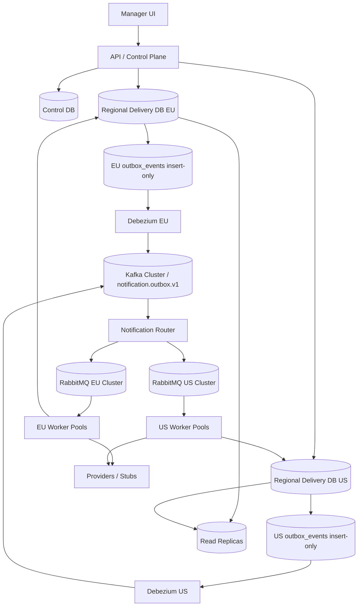

# Notification Platform — Production Architecture

Версия: 1.0  
Цель: описать путь от production-compatible MVP к production-grade архитектуре с regional sharding, Kafka/CDC, Debezium, Notification Router, RabbitMQ clusters, PostgreSQL partitioning и read replicas.

---

## 0. Target architecture summary

Production architecture keeps the same business model as MVP:

```text
Campaign -> CampaignRegionRun -> CampaignRecipients -> DeliveryTasks -> Attempts/Results/DLQ
```

But changes the transport and scaling layers:

```text
Control Plane DB
  -> regional run creation
  -> regional delivery DBs
  -> regional outbox_events insert-only
  -> Debezium CDC
  -> Kafka notification.outbox.v1
  -> Notification Router
  -> Regional RabbitMQ clusters
  -> Delivery Workers
  -> Providers
```

Core principles:

```text
1. PostgreSQL remains source of truth.
2. Outbox becomes insert-only for CDC path.
3. Kafka is durable event stream between DB and regional routers.
4. RabbitMQ remains low-latency delivery signal layer for workers.
5. Workers still load authoritative state from regional PostgreSQL.
6. Delivery semantics remain at-least-once + idempotency.
7. Sharding unit is region first, then optional campaign_region_run_id hash.
```

---

## 1. Production logical diagram



---

## 2. Control plane vs delivery plane

### 2.1 Control plane

Mostly low-volume, manager-facing, configuration-heavy:

```text
campaigns
channels
channel_regional_configs
regions
managers / auth references
idempotency_keys for API requests
campaign templates
provider/global configs metadata
```

Control plane can initially be one PostgreSQL primary with read replica.

### 2.2 Delivery plane

High-volume, write-heavy, region-scoped:

```text
users
user_channels
campaign_region_runs
campaign_recipients
delivery_tasks
delivery_attempts
delivery_results
dlq_items
campaign_stats_shards
regional_outbox_events
```

Delivery plane should be split by region when load grows:

```text
eu_delivery_db
us_delivery_db
apac_delivery_db
```

### 2.3 Campaign creation across planes

```text
1. API validates campaign in control plane.
2. API creates campaign metadata in Control DB.
3. For each region, API creates campaign_region_run in that regional delivery DB.
4. Regional DB insert creates outbox event CampaignRegionRunRequested.
5. CDC/Router/RabbitMQ wakes regional fan-out worker.
```

If distributed transaction is not used, use saga status:

```text
campaign.status = creating
region_run_create_requested
region_run_created
campaign.status = running after all required region runs created
```

---

## 3. Kafka / CDC / Debezium

### 3.1 Why introduce Kafka

MVP direct publisher works for 50k campaigns, but production introduces Kafka when:

```text
outbox publisher becomes DB hot worker
multiple downstream consumers need same events
regional routers need replay capability
cross-region observability/audit pipeline is required
RabbitMQ clusters must stay regional and isolated
```

Kafka is not the source of truth for task state. It is durable event transport.

---

### 3.2 Outbox CDC modes

#### Option A: one outbox table with `transport_mode`

MVP-compatible:

```text
outbox_events.transport_mode = rabbitmq_direct | cdc
```

Rules:

```text
direct publisher reads only transport_mode='rabbitmq_direct'
Debezium captures inserts with transport_mode='cdc'
cleanup archives/deletes old published/consumed rows
```

Risk:

```text
If status updates remain in same table, CDC can see update events unless connector/SMT is configured carefully.
```

#### Option B: insert-only outbox + separate publish state

Recommended production model:

```text
outbox_events          insert-only event records
outbox_publish_state   direct publisher state, only for non-CDC/local fallback
```

Schema idea:

```sql
CREATE TABLE outbox_events (
    region_id TEXT NOT NULL,
    id UUID NOT NULL DEFAULT gen_random_uuid(),
    aggregate_type TEXT NOT NULL,
    aggregate_id UUID NOT NULL,
    event_type TEXT NOT NULL,
    event_version INT NOT NULL DEFAULT 1,
    payload JSONB NOT NULL,
    headers JSONB NOT NULL DEFAULT '{}'::jsonb,
    stream_topic TEXT NOT NULL,
    message_key TEXT NOT NULL,
    dedupe_key TEXT NOT NULL,
    created_at TIMESTAMPTZ NOT NULL DEFAULT now(),
    PRIMARY KEY(region_id, id),
    UNIQUE(region_id, dedupe_key)
);

CREATE TABLE outbox_publish_state (
    region_id TEXT NOT NULL,
    outbox_event_id UUID NOT NULL,
    target TEXT NOT NULL,
    status TEXT NOT NULL,
    locked_by TEXT,
    locked_until TIMESTAMPTZ,
    attempt_count INT NOT NULL DEFAULT 0,
    next_attempt_at TIMESTAMPTZ NOT NULL DEFAULT now(),
    last_error TEXT,
    published_at TIMESTAMPTZ,
    PRIMARY KEY(region_id, outbox_event_id, target),
    FOREIGN KEY(region_id, outbox_event_id) REFERENCES outbox_events(region_id, id)
);
```

Benefit:

```text
Debezium path is pure insert-only.
No accidental update events.
Direct publisher fallback still possible.
```

---

### 3.3 Debezium Outbox Event Router mapping

Outbox fields:

```text
aggregate_type -> aggregatetype
aggregate_id   -> aggregateid / Kafka key
message_key    -> Kafka record key
event_type     -> event type header
payload        -> Kafka value
headers        -> Kafka headers
stream_topic   -> topic routing
```

Example logical connector mapping:

```properties
transforms=outbox
transforms.outbox.type=io.debezium.transforms.outbox.EventRouter
transforms.outbox.table.field.event.id=id
transforms.outbox.table.field.event.key=message_key
transforms.outbox.table.field.event.type=event_type
transforms.outbox.table.field.event.payload=payload
transforms.outbox.route.by.field=stream_topic
transforms.outbox.table.fields.additional.placement=region_id:header,campaign_region_run_id:header
```

Topic strategy:

```text
notification.outbox.v1                 single topic, key contains region/run/task
notification.outbox.eu.v1              optional regional topics
notification.outbox.us.v1
```

Recommended first production step:

```text
one topic: notification.outbox.v1
partition key: region_id + campaign_region_run_id
```

---

## 4. Notification Router

### 4.1 Role

Notification Router is a stateless Kafka consumer group that converts outbox stream events into regional RabbitMQ signals.

Responsibilities:

```text
1. Consume Kafka notification.outbox.v1.
2. Validate event schema/version.
3. Resolve target region and queue_group.
4. Publish to the correct regional RabbitMQ cluster.
5. Use publisher confirms.
6. Maintain idempotent publish state if needed.
7. Route poison events to router DLQ topic.
8. Emit observability metrics.
```

The router does not create/update delivery task state. Workers do that in PostgreSQL.

### 4.2 Routing table

Config source:

```text
region_id -> RabbitMQ cluster endpoint
queue_group -> exchange/routing_key template
priority -> routing key suffix / optional priority queue
```

Example:

```yaml
regions:
  eu:
    rabbitmqCluster: rmq-eu.internal
    exchange: notification.direct
  us:
    rabbitmqCluster: rmq-us.internal
    exchange: notification.direct
queueGroups:
  email:
    routingKey: notification.{region}.email.{priority}
  sms:
    routingKey: notification.{region}.sms.{priority}
  messenger:
    routingKey: notification.{region}.messenger.{priority}
```

### 4.3 Router idempotency

Kafka can redeliver, and RabbitMQ publish confirm can race with router crash.

Acceptable models:

```text
A. Idempotent workers only, router may publish duplicates.
B. Router publish state table/cache keyed by outbox event id.
```

Recommended:

```text
Start with A.
Use idempotent workers and DB transition guards.
Add B only if duplicate RabbitMQ signals become operationally expensive.
```

---

## 5. RabbitMQ production clusters

### 5.1 Regional clusters

Use separate RabbitMQ clusters per region when delivery traffic grows:

```text
rmq-eu
rmq-us
rmq-apac
```

Benefits:

```text
failure isolation
lower worker latency
regional operations
independent scaling
provider locality
```

### 5.2 Queue topology per region

```text
notification.eu.fanout.q
notification.eu.email.q
notification.eu.sms.q
notification.eu.push.q
notification.eu.messenger.q

notification.eu.email.retry.30s.q
notification.eu.email.retry.1m.q
notification.eu.email.retry.5m.q
notification.eu.email.retry.15m.q
...
notification.eu.email.dlq
notification.eu.messenger.dlq
```

Queue group prevents queue explosion:

```text
telegram/whatsapp/viber -> messenger queue group
```

Hot channel split later:

```text
telegram queue_group changes messenger -> telegram
create notification.eu.telegram.q
router uses new routing key
workers for telegram scale independently
```

### 5.3 Reliability settings

```text
quorum queues for durable critical queues
persistent messages
manual ack
publisher confirms
prefetch limits
DLX configured
bounded message size
lazy/overflow policies if needed
```

RabbitMQ remains a signal layer, not task state storage.

---

## 6. PostgreSQL partitioning and sharding

### 6.1 First scale step: read replicas

Before physical sharding, use read replicas for manager-facing reads:

```text
GET /campaigns
GET /campaigns/{id}
GET /campaigns/{id}/stats
GET /campaigns/{id}/tasks
GET /campaigns/{id}/results
GET /campaigns/{id}/errors
GET /dlq
```

Writes remain on primary:

```text
POST /campaigns
fan-out workers
delivery workers
outbox inserts
retry/DLQ/replay updates
```

### 6.2 Partitioning constraints

For partitioned tables, primary/unique keys must include partition key columns. Therefore hot tables already include:

```text
region_id
campaign_region_run_id where future sub-sharding matters
```

### 6.3 Table-by-table plan

| Table | First partition | Later subpartition | Notes |
|---|---|---|---|
| `delivery_tasks` | `LIST(region_id)` | `HASH(campaign_region_run_id)` | Main hot mutable table |
| `delivery_attempts` | `LIST(region_id)` | `RANGE(created_at)` or `HASH(run)` | Append-only; time retention |
| `delivery_results` | `LIST(region_id)` | `RANGE(completed_at)` | Audit/history; time retention |
| `campaign_recipients` | `LIST(region_id)` | `HASH(campaign_region_run_id)` | Large campaigns |
| `dlq_items` | `LIST(region_id)` | `RANGE(created_at)` | Query by region/campaign/channel/error/date |
| `outbox_events` | `LIST(region_id)` | `RANGE(created_at)` optional | Short retention; insert-only under CDC |
| `campaign_stats_shards` | none initially | increase logical shards | 64 -> 128 -> 256 if contention |

### 6.4 Example: `delivery_tasks` partitioning

```sql
CREATE TABLE delivery_tasks (
    region_id TEXT NOT NULL,
    campaign_region_run_id UUID NOT NULL,
    id UUID NOT NULL,
    ...,
    PRIMARY KEY(region_id, campaign_region_run_id, id)
) PARTITION BY LIST(region_id);

CREATE TABLE delivery_tasks_eu
PARTITION OF delivery_tasks
FOR VALUES IN ('eu')
PARTITION BY HASH(campaign_region_run_id);

CREATE TABLE delivery_tasks_eu_00
PARTITION OF delivery_tasks_eu
FOR VALUES WITH (MODULUS 16, REMAINDER 0);
```

### 6.5 Physical regional sharding

When a region outgrows one DB:

```text
regional DB per region first
inside one hot region: hash shard by campaign_region_run_id
```

Worker routing:

```text
message contains regionId + campaignRegionRunId
worker resolves shard from regionId/runId
loads task from correct regional/shard DB
```

---

## 7. Data retention and archival

### 7.1 Active vs historical data

Keep active mutable tables small:

```text
delivery_tasks: active + recent final tasks
delivery_attempts: partitioned by month/week
delivery_results: longer retention, partitioned by completed_at
dlq_items: retained while actionable
outbox_events: short retention after CDC consumed/archived
```

### 7.2 Suggested retention

| Data | Retention |
|---|---|
| `outbox_events` | 3-14 days hot, then archive/delete |
| `delivery_attempts` | 30-90 days hot, archive older partitions |
| `delivery_results` | per audit/product requirement, often 6-24 months |
| `delivery_tasks` | active + 30 days final, archive final old tasks |
| `dlq_items` | until replayed/ignored + retention policy |
| Application logs | 7-30 days depending cost/compliance |

---

## 8. Production delivery semantics

### 8.1 What is guaranteed

```text
campaign creation is idempotent by Idempotency-Key
task creation is deterministic and idempotent
events are at-least-once from outbox/CDC/Kafka/RabbitMQ
workers use lease_token guards
final results are inserted once by unique key
stats update only on successful state transition
```

### 8.2 What is not guaranteed

```text
No true exactly-once external delivery.
A worker can send to provider and crash before PostgreSQL finalization.
Another worker may retry after lease expiry.
```

### 8.3 Mitigations

```text
SendRequest.IdempotencyKey passed to providers that support it
provider_request_id saved
recipient/message snapshots immutable
lease heartbeat for slow providers
final-state guard
stale attempt handling
DLQ and replay from DB
```

---

## 9. Migration plan from MVP to production

### Phase 0 — MVP hardening

Required before scale-out:

```text
queue_group in channels
immutable result snapshots
atomic lease + attempt creation
lease heartbeat
stats transition guards
stats reconciliation job
retry recovery scanner
PostgreSQL dlq_items as source of truth
outbox partition-ready keys
hot table keys include campaign_region_run_id
```

### Phase 1 — Read replicas and retention

```text
1. Add read replica.
2. Route dashboard/list endpoints to replica.
3. Add outbox cleanup/archive.
4. Add attempts/results retention partitions if needed.
5. Validate p95 API under load.
```

### Phase 2 — PostgreSQL partitioning in one DB

```text
1. Partition delivery_attempts/results by time.
2. Partition delivery_tasks by region_id.
3. Add optional hash subpartitions by campaign_region_run_id for hot region.
4. Validate all primary/unique keys include partition keys.
5. Run dual-read comparison during migration.
```

### Phase 3 — CDC pilot

```text
1. Add transport_mode='cdc' for selected event types or test region.
2. Add Debezium connector for regional DB.
3. Publish to Kafka notification.outbox.v1.
4. Run Notification Router in shadow mode.
5. Compare RabbitMQ direct publisher vs router signals.
```

### Phase 4 — Switch selected region to CDC path

```text
1. For region=eu, set outbox transport to cdc.
2. Disable direct publisher for cdc events.
3. Router publishes to RabbitMQ EU.
4. Monitor duplicate/stale signal rates.
5. Keep rollback path: transport_mode back to rabbitmq_direct.
```

### Phase 5 — Regional RabbitMQ and regional DBs

```text
1. Split RabbitMQ clusters by region.
2. Move workers to regional deployments.
3. Move regional delivery tables to regional DBs.
4. Control plane creates runs in regional DBs via saga.
5. Keep control plane central initially.
```

### Phase 6 — Sub-sharding inside hot region

```text
1. Identify hot region/run distribution.
2. Add DB shards by hash(campaign_region_run_id).
3. Router/worker DB resolver maps region+run -> shard.
4. Keep task/message contracts unchanged.
```

---

## 10. Zero/low-downtime migration checklist

For each schema/transport change:

```text
1. Additive schema first.
2. Deploy code that writes old + new fields if needed.
3. Backfill in bounded batches.
4. Deploy code that reads new field with old fallback.
5. Validate metrics and sample data.
6. Switch read path.
7. Remove old path only after retention window.
```

For direct RabbitMQ -> CDC:

```text
1. Dual-write outbox columns already exist.
2. Debezium captures insert-only records.
3. Router runs in shadow mode first.
4. Compare expected routing_key/payload.
5. Enable router publish for one low-risk region/queue_group.
6. Disable direct publisher for that transport_mode.
7. Rollback by changing transport_mode back to rabbitmq_direct for new events.
```

---

## 11. Operational runbooks

### 11.1 Outbox stuck

Symptoms:

```text
outbox_oldest_pending_age_seconds high
pending rows increasing
RabbitMQ queue depth not increasing
```

Actions:

```text
1. Check publisher/router health.
2. Check RabbitMQ publisher confirms latency.
3. Check outbox locked rows.
4. Run outbox recovery for expired publishing locks.
5. Scale publisher/router if DB and RabbitMQ healthy.
```

### 11.2 Queue backlog grows

Actions:

```text
1. Check provider latency/error rate.
2. Check worker replicas/concurrency/prefetch.
3. Check rate limiter and circuit breaker.
4. Scale workers for queue_group.
5. Split hot channel out of messenger queue_group if needed.
```

### 11.3 Stats drift

Actions:

```text
1. Run reconciliation for affected campaign/region.
2. Inspect duplicate/stale attempts.
3. Check stats transition SQL guards.
4. Verify manual replay/cancel paths update stats through the same transition helper.
```

### 11.4 DLQ spike

Actions:

```text
1. Group by region/channel/provider/error_code.
2. Open/verify provider circuit breaker.
3. Disable channel or set retry_later if provider incident.
4. Replay from DB DLQ after provider recovery.
```

---

## 12. Production acceptance criteria

Production architecture is ready when:

```text
1. Regional delivery DB or partitioning can be enabled without changing message contracts.
2. Debezium captures insert-only outbox events.
3. Notification Router can route Kafka events to regional RabbitMQ clusters.
4. Workers remain idempotent under duplicate Kafka/RabbitMQ delivery.
5. Read-heavy endpoints can use read replicas.
6. delivery_tasks partitioning includes region_id and campaign_region_run_id in keys.
7. attempts/results/DLQ can be archived by partition drop.
8. New messenger channels do not create new queues unless intentionally split.
9. Hot channel split requires only config/topology changes, not API contract changes.
10. Rollback path exists for CDC migration.
11. Operational dashboards cover DB, Kafka, Router, RabbitMQ, workers, providers and stats drift.
```

---

## 13. Links / references

- Debezium Outbox Event Router: https://debezium.io/documentation/reference/stable/transformations/outbox-event-router.html
- RabbitMQ Quorum Queues: https://www.rabbitmq.com/docs/quorum-queues
- RabbitMQ TTL: https://www.rabbitmq.com/docs/ttl
- RabbitMQ Dead Letter Exchanges: https://www.rabbitmq.com/docs/dlx
- RabbitMQ Consumer Prefetch: https://www.rabbitmq.com/docs/consumer-prefetch
- PostgreSQL Table Partitioning: https://www.postgresql.org/docs/current/ddl-partitioning.html
